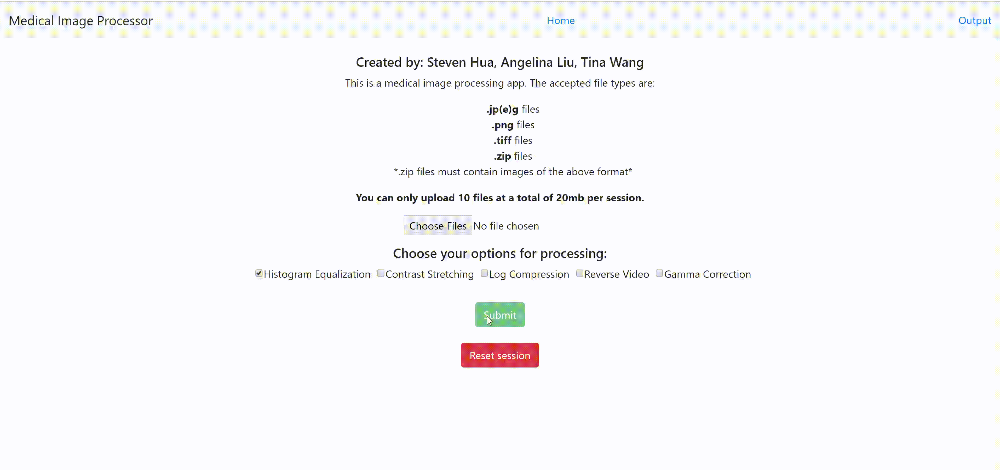

# BME 590 FINAL PROJECT: Image Processor 

##### Author: Steven Hua, Angelina Liu, Haitong Tina Wang 
##### Date: December 13, 2018 

----

_This project is for BME 590 Medical Device Development class. The goal of this project 
is to build a user interface (front-end) and a server (back-end) RESTful API to allow 
user to upload an image, a list of image or a zip file of JPEG/JPG, Tiff and PNG format to
a web-server to perform image-processing tasks on the web-server, then display and download 
the processed image._

----

### Linked to deployed web server: https://bmetester-484d1.firebaseapp.com/

**1.1 Content**

_Files Required to run server.py_ 

`bme590final` 
    
      |___server.py
 
      |___image_processing.py 
      
      |___test_image_processing.py 
  
      |___server_setup.md

      |___validation.py
 
      |___test_validation.py 
  
      |___histogram.py 
      
      |___test_histogram.py 
      
      |___test_validation.py
      
      |___test_histogram.py  
      
      |___image_processing_gui (REACT)     
      
      |___.travis.yml
      
      |___README.md
      
      |___requirement.txt
      
      |___.gitignore
      
      |___test_histogram
      
      |___test_resource 

**1.2 Demo Video** 

### Link to demo video: https://www.youtube.com/watch?v=37om1fB5FFc&feature=youtu.be

**1.3 Instruction To Use**

    1.3.1 Database and VCM deployment 
        
        Please refer to server_setup.md for detailed instruction on how to deploy on local machine 
        
    1.3.2 REACT user interface
        
        Please refer to image_processing_gui/README.md for detailed instruction on how to deploy on local machine 

**1.4 Individual Contribution and Break down**

    1.4.1 Angelina Liu 
    
          - all front end (react.js)
          
    1.4.2 Tina Haitong Wang 
    
          - server
          - image processing
          - database 
          
    1.4.3 Steven Hua 
        
          - valdiation 
          - histogram 
          - unit testing 
          - sphinx 
          - all other assigned duties 
          
    
